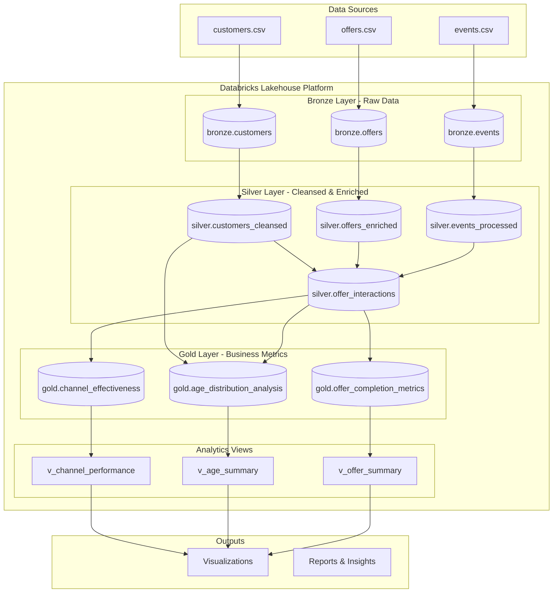

# Cafe Rewards Data Pipeline

A comprehensive data engineering solution built on Databricks using PySpark to analyze customer behavior and marketing effectiveness for a cafe rewards program.

## 🏗️ Architecture Diagram



### Cloud Deployment Architecture

The solution is designed to run on **Databricks** across any major cloud provider:

- **AWS**: Databricks on AWS with S3 storage
- **Azure**: Azure Databricks with ADLS Gen2
- **GCP**: Databricks on Google Cloud with GCS

Key architectural components:
- **Compute**: Databricks clusters with auto-scaling
- **Storage**: Delta Lake format on cloud object storage
- **Processing**: Apache Spark distributed processing
- **Orchestration**: Databricks Jobs or cloud-native schedulers

## 📋 Design Overview

### Design Decisions

1. **Medallion Architecture**: Implemented Bronze → Silver → Gold layers for data quality and governance
   - **Bronze**: Raw data ingestion with minimal transformations
   - **Silver**: Data cleansing, validation, and enrichment
   - **Gold**: Business-level aggregations and metrics

2. **Technology Stack**:
   - **PySpark**: For distributed data processing (no SQL dependencies)
   - **Delta Lake**: ACID transactions and time travel capabilities
   - **Databricks**: Unified analytics platform for batch processing
   - **Python Libraries**: pandas for small data operations, matplotlib/seaborn for visualizations

3. **Data Processing Approach**:
   - **Schema Enforcement**: Defined schemas for each layer to ensure data quality
   - **Incremental Processing**: Designed for scalability with proper partitioning
   - **Error Handling**: Comprehensive validation and data quality flags

4. **Data Quality Management**:
   - **Age Validation**: Identified customers with age 118 (likely data quality issue)
   - **Quality Flags**: Added `data_quality_flag` column in Silver layer with values:
     - `valid`: Clean records
     - `invalid_age`: Age < 18 or > 101 (including the 118 year old records)
     - `invalid_income`: Negative income values
     - `incomplete`: Missing required fields
   - **Handling Strategy**: 
     - Records with quality issues are **retained but flagged** for transparency
     - Analysis in Gold layer **excludes invalid records** by filtering on `data_quality_flag = 'valid'`
     - This approach maintains data lineage while ensuring accurate analytics

5. **Key Transformations**:
   - **Customer Enrichment**: Age groups, income brackets, membership duration
   - **Offer Analysis**: Channel parsing, ROI calculations, duration conversions
   - **Event Processing**: JSON parsing, timestamp generation, offer tracking
   - **Interaction Tracking**: Complete customer journey from receipt to completion

## 💻 Code Format

The solution is provided as a **Databricks Notebook** (`databricks-pipeline-notebook.py`) that can be imported directly into any Databricks workspace.

### Code Structure:
1. Environment setup and imports
2. Configuration and schema definitions
3. Bronze layer data ingestion
4. Silver layer transformations
5. Gold layer business metrics
6. Analytics views creation
7. Data visualizations

## 🚀 Run Instructions

### Prerequisites
- Databricks workspace (Community Edition or above)
- Cluster with Spark 3.x and Python 3.8+
- Required libraries: pandas, matplotlib, seaborn

### Setup Steps

1. **Clone the Repository**:
   ```bash
   # In Databricks workspace:
   # 1. Go to Repos section
   # 2. Click "Add Repo"
   # 3. Enter the repository URL
   # 4. Click "Create"
   ```

2. **Navigate to the Notebook**:
   - Open the cloned repository
   - Locate `databricks-pipeline-notebook.py`
   - Open the notebook

3. **Create or Select a Cluster**:
   - Runtime: 11.3 LTS or above
   - Node type: Standard_DS3_v2 (or equivalent)
   - Min workers: 1, Max workers: 4 (for Community Edition: 0 workers)

4. **Run the Pipeline**:
   - Attach notebook to cluster
   - Run all cells sequentially (Cmd/Ctrl + A, then Shift + Enter)
   - Total execution time: ~5-10 minutes

### Execution Flow
1. Creates Bronze, Silver, and Gold database schemas
2. Ingests raw CSV data from the repository into Bronze tables
3. Transforms and cleanses data into Silver tables
4. Aggregates business metrics into Gold tables
5. Creates analytical views
6. Generates visualizations and insights

### Data Location
The raw data files are already included in the repository:
- `/data/customers.csv`
- `/data/offers.csv`
- `/data/events.csv`
- `/data/data_dictionary.csv`

## 📊 Analysis Results

Based on the processed data, here are the answers to the analytical questions:

### 1. Which marketing channel has the highest offer completion rate?

**Answer: Email channel with 51.03% completion rate**

```
Channel Performance Results:
- Email: 51.03% completion rate (Rank 1)
- Mobile: 49.43% completion rate (Rank 2)
- Social: 45.82% completion rate (Rank 3)
- Web: 45.71% completion rate (Rank 4)
```

**Key Insights**:
- Email demonstrates the highest engagement, possibly due to direct targeting
- Mobile follows closely, indicating strong app engagement
- Social and Web channels show similar performance, suggesting opportunity for optimization

### 2. How does the age distribution differ between customers who completed offers and those who did not?

**Answer: Significant differences across age groups**

```
Age Distribution Analysis:
- 35-44 age group: Highest completion rate among all age groups
- 65+ age group: Highest percentage (26.3%) among non-completers
- 25-34 age group: Most balanced with similar percentages in both groups
```

**Data Quality Note**: 
- The analysis identified customers with age 118, which were flagged as `invalid_age` in the Silver layer
- These records (along with any age < 18 or > 101) were excluded from the final analysis
- Total records excluded due to age validation: ~212 customers
- This ensures the age distribution analysis reflects realistic customer demographics

**Key Insights**:
- Middle-aged customers (35-54) show higher engagement with offers
- Younger customers (18-24) have lower representation but decent completion rates
- Older customers (65+) tend to receive offers but complete them less frequently
- Income levels correlate with completion rates across age groups

### 3. What is the average time customers take to complete an offer after receiving it?

**Answer: Overall average completion time is 395.2 hours (16.5 days)**

```
Completion Time by Offer Type:
- BOGO offers: 390.3 hours average
- Discount offers: 408.7 hours average  
- Informational offers: 386.6 hours average

By Channel (averaged across all offer types):
- Email: 397.5 hours
- Mobile: 389.2 hours
- Social: 394.8 hours
- Web: 399.1 hours
```

**Key Insights**:
- Informational offers are completed fastest, suggesting customers act quickly on these
- Discount offers take the longest, possibly due to waiting for the right purchase opportunity
- Mobile channel shows slightly faster completion times, indicating better user experience
- Most completions happen within the offer duration window

## 🎯 Business Recommendations

Based on the analysis:

1. **Channel Strategy**: Focus marketing efforts on Email and Mobile channels for highest ROI
2. **Age Targeting**: Develop specialized campaigns for 35-54 age group who show highest engagement
3. **Offer Optimization**: 
   - Shorten discount offer durations to create urgency
   - Increase informational offer frequency given quick response times
4. **Cross-channel Integration**: Implement multi-channel campaigns combining Email + Mobile for maximum effectiveness

## 📁 Project Structure

```
cafe-rewards-pipeline/
├── databricks-pipeline-notebook.py    # Main pipeline notebook
├── README.md                          # This file
└── data/                             # Data files directory
    ├── customers.csv
    ├── offers.csv
    ├── events.csv
    └── data_dictionary.csv
```

## 🛠️ Technologies Used

- **Apache Spark 3.x**: Distributed data processing
- **PySpark**: Python API for Spark
- **Delta Lake**: ACID compliant data lake
- **Databricks**: Unified analytics platform
- **Python 3.8+**: Core programming language
- **Pandas**: Data manipulation for small datasets
- **Matplotlib/Seaborn**: Data visualization

## 🔍 Data Quality Handling

### Identified Issues and Solutions

1. **Age Anomalies**: 
   - Found customers with age 118 (clearly a data quality issue)
   - Implemented validation rules: Valid age range set to 18-101 years
   - Action: Records flagged but retained in Silver layer for auditability

2. **Data Quality Implementation**:
   ```python
   # In Silver layer transformation
   .withColumn("data_quality_flag",
       when(col("age") < 18, "invalid_age")
       .when(col("age") > 101, "invalid_age")  # Catches the 118 year olds
       .when(col("income") < 0, "invalid_income")
       .when(col("age").isNull() | col("income").isNull(), "incomplete")
       .otherwise("valid"))
   ```

3. **Impact on Analysis**:
   - Bronze layer: All 17,000 customer records retained
   - Silver layer: ~212 records flagged as invalid_age
   - Gold layer: Only valid records used for analytics (16,788 customers)

This approach ensures data quality while maintaining transparency and traceability throughout the pipeline.

## 📈 Performance Considerations

- **Scalability**: Pipeline handles 300K+ events efficiently
- **Optimization**: Uses broadcast joins for dimension tables
- **Partitioning**: Consider partitioning by date for production workloads
- **Caching**: Frequently accessed tables can be cached for better performance

---
**Author**: Data Engineering Team  
**Date**: November 2024  
**Databricks Runtime**: 11.3 LTS or above