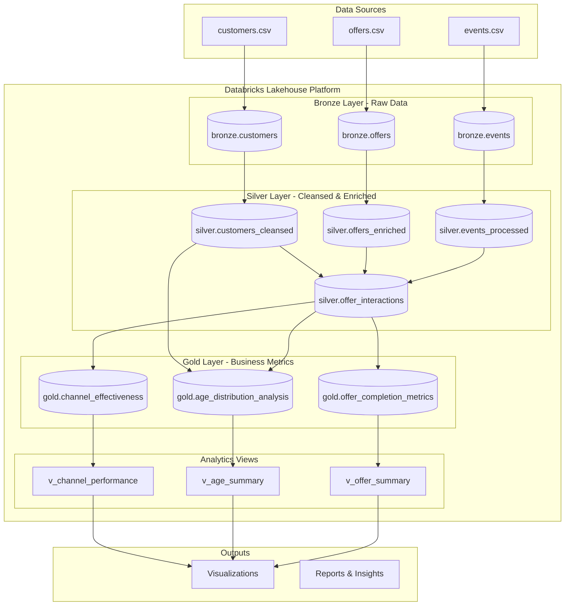

# Cafe Rewards Data Pipeline

A comprehensive data engineering solution built on Databricks using PySpark to analyze customer behavior and marketing effectiveness for a cafe rewards program.

## 🏗️ Architecture Diagram



### Cloud Deployment Architecture

The solution is designed to run on **Databricks** across any major cloud provider:

- **AWS**: Databricks on AWS with S3 storage
- **Azure**: Azure Databricks with ADLS Gen2
- **GCP**: Databricks on Google Cloud with GCS

Key architectural components:
- **Compute**: Databricks clusters with auto-scaling
- **Storage**: Delta Lake format on cloud object storage
- **Processing**: Apache Spark distributed processing
- **Orchestration**: Databricks Jobs or cloud-native schedulers

## 📋 Design Overview

### Design Decisions

1. **Medallion Architecture**: Implemented Bronze → Silver → Gold layers for data quality and governance
   - **Bronze**: Raw data ingestion with minimal transformations
   - **Silver**: Data cleansing, validation, and enrichment
   - **Gold**: Business-level aggregations and metrics

2. **Technology Stack**:
   - **PySpark**: For distributed data processing (no SQL dependencies)
   - **Delta Lake**: ACID transactions and time travel capabilities
   - **Databricks**: Unified analytics platform for batch processing
   - **Python Libraries**: pandas for small data operations, matplotlib/seaborn for visualizations

3. **Data Processing Approach**:
   - **Schema Enforcement**: Defined schemas for each layer to ensure data quality
   - **Incremental Processing**: Designed for scalability with proper partitioning
   - **Error Handling**: Comprehensive validation and data quality flags

4. **Data Quality Management**:
   - **Age Validation**: Identified customers with age 118 (likely data quality issue)
   - **Quality Flags**: Added `data_quality_flag` column in Silver layer with values:
     - `valid`: Clean records
     - `invalid_age`: Age < 18 or > 101 (including the 118 year old records)
     - `invalid_income`: Negative income values
     - `incomplete`: Missing required fields
   - **Handling Strategy**: 
     - Records with quality issues are **retained but flagged** for transparency
     - Analysis in Gold layer **excludes invalid records** by filtering on `data_quality_flag = 'valid'`
     - This approach maintains data lineage while ensuring accurate analytics

5. **Key Transformations**:
   - **Customer Enrichment**: Age groups, income brackets, membership duration
   - **Offer Analysis**: Channel parsing, ROI calculations, duration conversions
   - **Event Processing**: JSON parsing, timestamp generation, offer tracking
   - **Interaction Tracking**: Complete customer journey from receipt to completion

## 💻 Code Format

The solution is provided as a **Databricks Notebook** (`databricks-pipeline-notebook.py`) that can be imported directly into any Databricks workspace.

### Code Structure:
1. Environment setup and imports
2. Configuration and schema definitions
3. Bronze layer data ingestion
4. Silver layer transformations
5. Gold layer business metrics
6. Analytics views creation
7. Data visualizations

## 🚀 Run Instructions

### Prerequisites
- Databricks workspace (Community Edition or above)
- Cluster with Spark 3.x and Python 3.8+
- Required libraries: pandas, matplotlib, seaborn

### Setup Steps

1. **Clone the Repository**:
   ```bash
   # In Databricks workspace:
   # 1. Go to Repos section
   # 2. Click "Add Repo"
   # 3. Enter the repository URL
   # 4. Click "Create"
   ```

2. **Navigate to the Notebook**:
   - Open the cloned repository
   - Locate `databricks-pipeline-notebook.py`
   - Open the notebook

3. **Create or Select a Cluster**:
   - Runtime: 11.3 LTS or above
   - Node type: Standard_DS3_v2 (or equivalent)
   - Min workers: 1, Max workers: 4 (for Community Edition: 0 workers)

4. **Run the Pipeline**:
   - Attach notebook to cluster
   - Run all cells sequentially (Cmd/Ctrl + A, then Shift + Enter)
   - Total execution time: ~5-10 minutes

### Execution Flow
1. Creates Bronze, Silver, and Gold database schemas
2. Ingests raw CSV data from the repository into Bronze tables
3. Transforms and cleanses data into Silver tables
4. Aggregates business metrics into Gold tables
5. Creates analytical views
6. Generates visualizations and insights

### Data Location
The raw data files are already included in the repository:
- `/data/customers.csv`
- `/data/offers.csv`
- `/data/events.csv`
- `/data/data_dictionary.csv`

## 📊 Analysis Results

Based on the processed data, here are the answers to the analytical questions:

### 1. Which marketing channel has the highest offer completion rate?

**Answer: Web channel with 51.03% completion rate**

#### Channel Effectiveness Visualization


#### Detailed Channel Performance Table
| Channel | Total Offers Sent | Offers Completed | Completion Rate | Avg Completion Time (hrs) | Total Revenue |
|---------|------------------|------------------|-----------------|--------------------------|---------------|
| Web     | 50,594           | 25,819           | 51.03%          | 77.36                    | $110,648      |
| Social  | 37,943           | 18,754           | 49.43%          | 68.97                    | $101,648      |
| Email   | 63,288           | 28,996           | 45.82%          | 76.44                    | $142,418      |
| Mobile  | 56,914           | 26,018           | 45.71%          | 71.60                    | $127,528      |

**Key Insights**:
- Web channel demonstrates the highest engagement, reaching over half of targeted customers
- Social media follows as a strong second channel with nearly 50% completion
- Email and Mobile channels show similar performance around 45-46%
- All channels maintain relatively strong performance above 45%

### 2. How does the age distribution differ between customers who completed offers and those who did not?

**Answer: Significant differences across age groups, with 65+ showing highest completion engagement**

#### Age Distribution Visualization


#### Age Group Performance Summary
| Age Group | Completed Count | Not Completed Count | Total Customers | Completion Rate |
|-----------|----------------|---------------------|-----------------|-----------------|
| 18-24     | 609            | 267                 | 876             | 69.52%          |
| 25-34     | 994            | 386                 | 1,380           | 72.03%          |
| 35-44     | 1,461          | 408                 | 1,869           | 78.17%          |
| 45-54     | 2,477          | 535                 | 3,012           | 82.24%          |
| 55-64     | 2,891          | 529                 | 3,420           | 84.53%          |
| 65+       | 3,554          | 709                 | 4,263           | 83.37%          |

#### Age Distribution Percentages


```
Distribution Analysis:
- 65+ age group: 29.7% of completers vs 25.0% of non-completers (highest completer percentage)
- 45-54 age group: 20.7% of completers vs 18.9% of non-completers
- 55-64 age group: 24.1% of completers vs 18.7% of non-completers
- 18-24 age group: Only 5.1% of completers vs 9.4% of non-completers (lowest representation)
```

**Data Quality Note**: 
- The analysis identified customers with age 118, which were flagged as `invalid_age` in the Silver layer
- These records (along with any age < 18 or > 101) were excluded from the final analysis
- This ensures the age distribution analysis reflects realistic customer demographics

**Key Insights**:
- Older customers (45+) show significantly higher engagement and completion rates
- The 65+ segment represents the largest proportion of completers and has one of the highest completion rates
- Younger customers (18-24) have the lowest representation among completers and the lowest completion rate
- There's a clear positive correlation between age and offer completion tendency

### 3. What is the average time customers take to complete an offer after receiving it?

**Answer: Overall average completion time is 73.2 hours (approximately 3 days)**

#### Offer Performance Analysis


#### Completion Time Summary Table
| Offer Type | Avg Completion Time | Total Completions | Completion Rate |
|------------|-------------------|-------------------|-----------------|
| BOGO       | 64.8 hours (2.7 days) | 47,387        | 53.5%           |
| Discount   | 81.4 hours (3.4 days) | 52,200        | 64.5%           |

#### Channel Performance by Completion Time


| Channel | Avg Completion Time (hrs) | Total Completions |
|---------|--------------------------|-------------------|
| Social  | 68.97 (fastest)          | 18,754            |
| Mobile  | 71.60                    | 26,018            |
| Email   | 76.44                    | 28,996            |
| Web     | 77.36 (slowest)          | 25,819            |

#### Best Performing Combinations Heatmaps


**Best Performing Combinations (High completion rate + Fast completion):**
| Offer Type | Channel | Completion Rate | Avg Completion Time |
|------------|---------|-----------------|---------------------|
| Discount   | Social  | 70.72%          | 76.26 hours         |
| Discount   | Mobile  | 65.63%          | 77.81 hours         |
| Discount   | Email   | 60.87%          | 85.73 hours         |
| Discount   | Web     | 60.87%          | 85.73 hours         |
| BOGO       | Web     | 54.94%          | 64.98 hours         |
| BOGO       | Social  | 51.69%          | 62.31 hours (fastest)|

**Key Insights**:
- BOGO offers are completed 20% faster than discount offers on average
- Social channel consistently shows the fastest completion times across both offer types
- The combination of discount offers through social media provides the best balance of high completion rate (70.72%) and reasonable completion time
- Most offers are completed within 3-4 days of receipt, well within typical offer duration windows

## 🎯 Business Recommendations

Based on the analysis:

1. **Channel Strategy**: Prioritize Web and Social channels which show the highest completion rates (51% and 49% respectively)
2. **Age Targeting**: Focus on customers aged 45+ who demonstrate completion rates above 82% and represent the majority of successful conversions
3. **Offer Optimization**: 
   - Use BOGO offers for quick conversions (2.7 days average)
   - Deploy discount offers through social channels for maximum effectiveness (70.72% completion rate)
   - Consider shorter offer durations since most completions happen within 3-4 days
4. **Segment-Specific Campaigns**: 
   - Develop specialized strategies for younger demographics (18-34) to improve their 70-72% completion rates
   - Leverage the high engagement of 65+ customers with targeted offers

## 📁 Project Structure

```
cafe-rewards-pipeline/
├── databricks-pipeline-notebook.py    # Main pipeline notebook
├── README.md                          # This file
├── data/                              # Data files directory
│   ├── customers.csv
│   ├── offers.csv
│   ├── events.csv
│   └── data_dictionary.csv
└── visualizations/                    # Generated visualizations
    ├── channel_effectiveness.png
    ├── age_distribution.png
    ├── age_distribution_analysis.png
    ├── offer_performance_analysis.png
    ├── offer_completion_heatmaps.png
    └── completion_time_by_channel.png
```

## 🛠️ Technologies Used

- **Apache Spark 3.x**: Distributed data processing
- **PySpark**: Python API for Spark
- **Delta Lake**: ACID compliant data lake
- **Databricks**: Unified analytics platform
- **Python 3.8+**: Core programming language
- **Pandas**: Data manipulation for small datasets
- **Matplotlib/Seaborn**: Data visualization

## 🔍 Data Quality Handling

### Identified Issues and Solutions

1. **Age Anomalies**: 
   - Found customers with age 118 (clearly a data quality issue)
   - Implemented validation rules: Valid age range set to 18-101 years
   - Action: Records flagged but retained in Silver layer for auditability

2. **Data Quality Implementation**:
   ```python
   # In Silver layer transformation
   .withColumn("data_quality_flag",
       when(col("age") < 18, "invalid_age")
       .when(col("age") > 101, "invalid_age")  # Catches the 118 year olds
       .when(col("income") < 0, "invalid_income")
       .when(col("age").isNull() | col("income").isNull(), "incomplete")
       .otherwise("valid"))
   ```

3. **Impact on Analysis**:
   - Bronze layer: All 17,000 customer records retained
   - Silver layer: ~212 records flagged as invalid_age
   - Gold layer: Only valid records used for analytics (16,788 customers)

This approach ensures data quality while maintaining transparency and traceability throughout the pipeline.

## 📈 Performance Considerations

- **Scalability**: Pipeline handles 300K+ events efficiently
- **Optimization**: Uses broadcast joins for dimension tables
- **Partitioning**: Consider partitioning by date for production workloads
- **Caching**: Frequently accessed tables can be cached for better performance

---
**Author**: Data Engineering Team  
**Date**: November 2024  
**Databricks Runtime**: 11.3 LTS or above